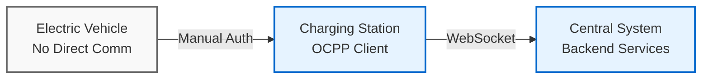
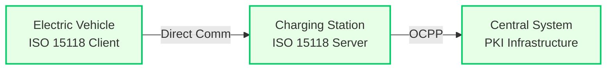
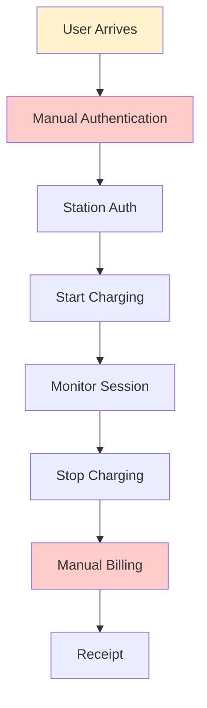
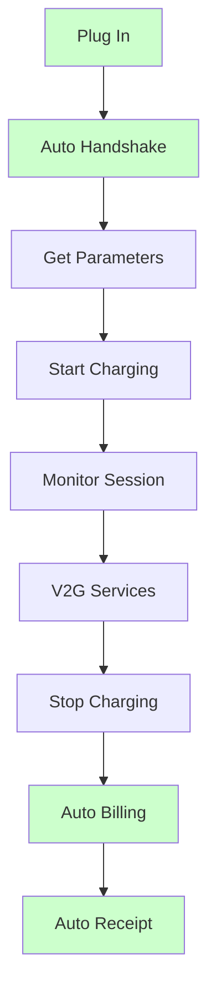

# Visual Diagram


## 🔄 System Architecture Diagrams

### **OCPP 1.6 Architecture (Visual Version)**

**Elements to include:**
- Electric Vehicle (no direct communication)
- Charging Station (OCPP client)
- Central System (backend services)
- WebSocket connections
- HTTP/REST connections
- Color coding: Blue for OCPP, Gray for no communication

**Key visual elements:**
- Dashed line between EV and Station (no direct communication)
- Solid line between Station and Central System
- WebSocket icon on connection
- JSON message icons

### **ISO 15118 Architecture (Visual Version)**

**Elements to include:**
- Electric Vehicle (ISO 15118 client)
- Charging Station (ISO 15118 server + OCPP client)
- Central System (PKI infrastructure)
- ISO 15118 connections (PLC/Wireless)
- OCPP connections
- Color coding: Green for ISO 15118, Blue for OCPP

**Key visual elements:**
- Solid line between EV and Station (direct communication)
- Digital certificate icons
- PKI infrastructure visualization
- V2G service indicators

---

## 🔄 Workflow Diagrams

### **OCPP 1.6 Workflow (Visual Version)**

**Flow elements:**
1. User arrives (person icon)
2. Manual authentication (RFID/app icons)
3. Station authentication (server icon)
4. Charging session (battery icon)
5. Monitoring (dashboard icon)
6. Billing (payment icon)

**Visual style:**
- Flowchart with decision diamonds
- Color-coded steps
- Icons for each step
- Clear progression arrows

### **ISO 15118 Workflow (Visual Version)**

**Flow elements:**
1. Plug in (plug icon)
2. Automatic handshake (handshake icon)
3. Parameter exchange (data icon)
4. Smart charging (brain icon)
5. V2G capabilities (bidirectional arrow)
6. Automatic billing (auto-payment icon)

**Visual style:**
- Smooth flow without decision points
- Green color scheme
- Automation indicators
- V2G service highlights

---

## 🎯 Diagram Color Schemes

### **OCPP 1.6 Color Palette:**
- **Primary Blue**: #0066CC (Electric Blue)
- **Secondary Gray**: #666666 (No Communication)
- **Accent Orange**: #FF6600 (Manual Steps)
- **Background**: #F5F5F5 (Light Gray)

### **ISO 15118 Color Palette:**
- **Primary Green**: #00CC66 (Success Green)
- **Secondary Blue**: #0066CC (OCPP Integration)
- **Accent Purple**: #9933CC (V2G Services)
- **Background**: #F5F5F5 (Light Gray)

---

## 📐 Diagram Templates

### **System Architecture Template:**
```
┌─────────────────┐    Connection    ┌──────────────────┐
│   Component 1   │ ◄──────────────► │   Component 2    │
│                 │                 │                  │
│ • Feature 1     │                 │ • Feature 1      │
│ • Feature 2     │                 │ • Feature 2      │
│ • Feature 3     │                 │ • Feature 3      │
└─────────────────┘                 └──────────────────┘
```

### **Workflow Template:**
```
Step 1: Action
   │
   ▼
Step 2: Decision?
   ├─ Yes → Step 3A
   └─ No  → Step 3B
   │
   ▼
Step 4: Final Action
```

---

## 🔧 Mermaid Code Examples

### **OCPP 1.6 System Architecture:**


### **ISO 15118 System Architecture:**


### **OCPP 1.6 Workflow:**


### **ISO 15118 Workflow:**


---

## 📊 Comparison Diagrams

### **Side-by-Side Architecture Comparison:**
```
OCPP 1.6                    ISO 15118
┌─────────┐                 ┌─────────┐
│   EV    │                 │   EV    │
│ (No Dir)│                 │ (Direct)│
└─────────┘                 └─────────┘
     │                           │
     ▼                           ▼
┌─────────┐                 ┌─────────┐
│ Station │                 │ Station │
└─────────┘                 └─────────┘
     │                           │
     ▼                           ▼
┌─────────┐                 ┌─────────┐
│ Central │                 │ Central │
│ System  │                 │ System  │
└─────────┘                 └─────────┘
```

### **Workflow Comparison:**
```
OCPP 1.6: Manual → Auth → Charge → Manual Billing
ISO 15118: Plug → Auto → Charge → Auto Billing
```

---

## 🎨 Professional Design Tips

### **Typography:**
- Use consistent fonts (Arial, Calibri)
- Hierarchy: Title (18pt), Subtitle (14pt), Body (12pt)
- Bold for emphasis, italic for notes

### **Spacing:**
- Consistent margins (0.5 inch minimum)
- Equal spacing between elements
- Group related components

### **Icons:**
- Use standard icons for clarity
- Consistent icon style throughout
- Size: 16x16px for small, 24x24px for medium

### **Colors:**
- Maximum 4-5 colors per diagram
- Use color to show relationships
- Ensure contrast for readability

---

## 📱 Export Formats

### **For PowerPoint:**
- PNG format (300 DPI)
- Transparent background
- Size: 1920x1080px or 1280x720px

### **For Web:**
- SVG format (scalable)
- PNG format (fallback)
- Size: 800x600px or 1200x900px

### **For Print:**
- PDF format (vector)
- High resolution (600 DPI)
- CMYK color space

---

## 🔗 Resources

### **Icon Libraries:**
- **Feather Icons**: https://feathericons.com/
- **Material Icons**: https://material.io/icons/
- **Font Awesome**: https://fontawesome.com/

### **Color Palettes:**
- **Coolors**: https://coolors.co/
- **Adobe Color**: https://color.adobe.com/
- **Color Hunt**: https://colorhunt.co/

### **Templates:**
- **Draw.io Templates**: https://app.diagrams.net/
- **Lucidchart Templates**: https://www.lucidchart.com/templates
- **Visio Templates**: Microsoft Office

---

## 📋 Checklist for Professional Diagrams

### **Before Creating:**
- [ ] Define the purpose and audience
- [ ] Choose appropriate tool
- [ ] Plan color scheme
- [ ] Gather required icons

### **During Creation:**
- [ ] Use consistent styling
- [ ] Maintain proper spacing
- [ ] Include clear labels
- [ ] Add legends if needed

### **After Creation:**
- [ ] Review for clarity
- [ ] Test readability
- [ ] Export in multiple formats
- [ ] Get feedback from team

---

## 🎯 Integration with Presentation

### **Slide Placement:**
- Architecture diagrams: Slides 5-6
- Workflow diagrams: Slides 7-8
- Comparison diagrams: Slides 9-10
- Security diagrams: Slide 11

### **Animation Suggestions:**
- Reveal components step by step
- Highlight differences with color changes
- Show data flow with moving arrows
- Animate workflow progression

### **Interactive Elements:**
- Click to expand details
- Hover for additional information
- Zoom in on specific components
- Toggle between OCPP and ISO 15118 views 
